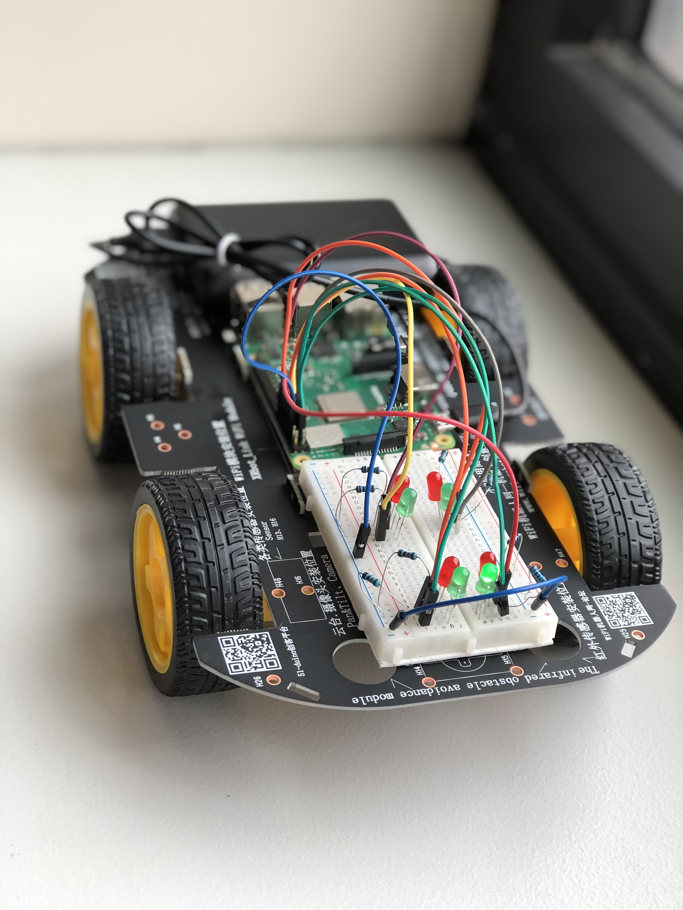
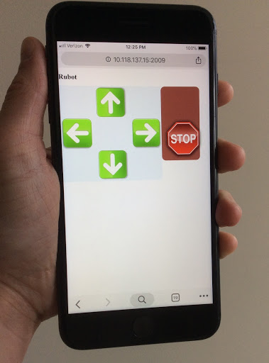
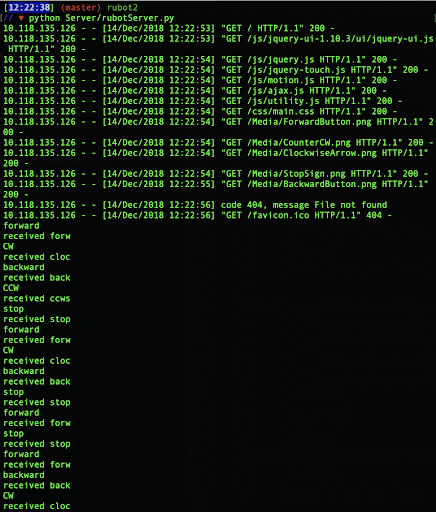

# Rubot

Rubot is a robotic system that responds to user input. The base of the robot is a Raspberry Pi onto which all of the code in this repository must be loaded in order to run the program.



## Software

The Rubot repo contains code for:
+ a Python server
+ a Javascript, HTML, CSS user interface
+ Python functions that trigger action in hardware

## Hardware

Things you need:
+ a Raspberry Pi and power cord
+ a monitor
+ a keyboard and mouse
+ an HDMI to HDMI cable
+ a micro SD card

## Setup

1. Install the operating system:
[Installation - Raspberry Pi Documentation](https://www.raspberrypi.org/documentation/installation/)
2. Hook up to wifi
3. To find the IP address of your Raspberry Pi, on the Raspberry Pi terminal run:


```bash
ifconfig
```

4. To run the Python server, on the Raspberry Pi terminal run:


```bash
python Server/rubotServer.py
```
5. Now that the server is running on the Raspberry Pi, any computer or phone on the same wifi can connect to the server. On your computer or phone, connect to the Raspberry Pi server by going to the IP address port 2009. Open a browser and in the address bar type


```
yourRapberryPiIPaddress:2009
```
7. You should see:

8. Now you can send requests to the server by hitting any of the buttons, and you should see the requests logged to the terminal on the Raspberry Pi like this:


## Contributing
1.  Fork it (https://github.com/rubyreilly/rubot-repo/fork)
2.  Create your feature branch (`git checkout -b feature/fooBar`)
3.  Commit your changes (`git commit -m 'Added fooBar'`)
4.  Push to the branch (`git push origin feature/fooBar`)
5.  Create a new Pull Request

[Help Guides and Resources - How to Use Raspberry Pi](https://www.raspberrypi.org/help/)

## Contact

Ruby Reilly – [my github](https://github.com/rubyreilly) – [rubyclaroreilly@gmail.com](mailto:rubyclaroreilly@gmail.com)
